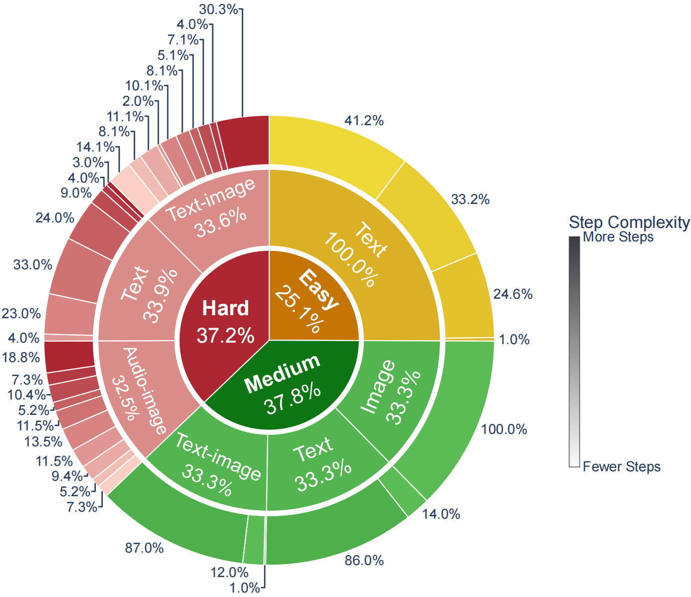
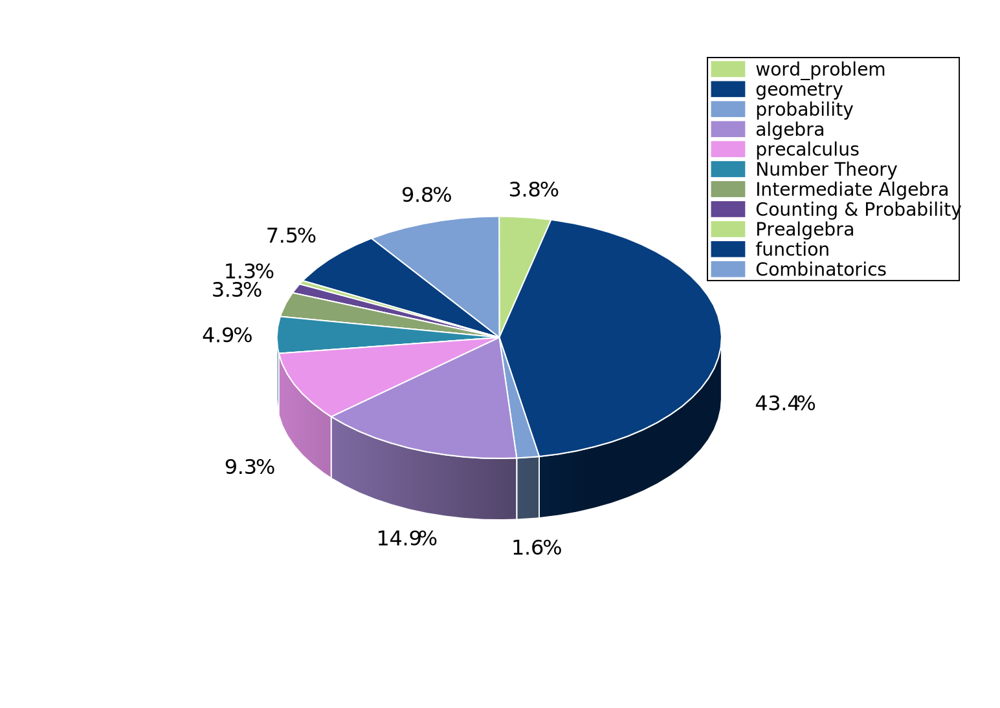

# 📐 多模态多智能体数学推理基准 [](#dataset-statistics) [](#key-features) 
---
**面向大模型多智能体系统的多模态数学推理专用基准** 致力于解决传统多智能体数学问答基准**单模态限制、仅结果导向评估、缺乏协作鲁棒性测试**三大核心缺陷，为多智能体数学推理提供全维度、细粒度、过程化的评估能力。
## 🎯 基准定位 
MAMath-Bench 聚焦**LLM 多智能体协作数学推理**场景，覆盖文本/图像/音频/图文4类输入形式，通过**阶梯难度+过程里程碑+对抗负样本**，全面测评智能体团队的： 
- 多模态信息融合与对齐能力 
- 多智能体分步推理与协作验证能力 
- 错误检测、诊断与自恢复能力 
<div align="center"> <!-- 点击图片会跳转到PDF，target="_blank"会在新标签页打开 --> <a href="images/fig11.pdf" target="_blank">  </a> <p>图1：难度、模态与推理步骤复杂度分布</p> </div>


## ✨ 核心特性 
1. **🌐 首创多模态输入设计** 
突破纯文本限制，支持文本、图像、音频、图文4种输入组合，还原真实数学问题场景。
2. **📝 细粒度推理里程碑标注** 为800个正样本提供**分步逻辑里程碑**，支持推理过程质量评估，而非仅看最终答案。
3. **⚠️ 对抗性负样本构建** 203个高精度负样本，包含**5类逻辑缺陷**，精准测试智能体协作中的错误抗性与恢复力。 
4. **📊 三级难度梯度** 按推理链长度与模态复杂度分级：简易(1–3步)、中等(4–6步)、困难(6–20步)，覆盖从小学到IMO竞赛难度。 
5. **🧮 全领域数学覆盖** 覆盖几何、代数、组合数学、数论等**11大数学领域**，全面检验推理上限。
--- 
## 📊 数据集统计
| 统计项 | 数值 |
| :--- | :--- | 
| 总样本数 | 1003 | 
| 正样本 | 800 | 
| 负样本 | 203 | 
| 简易难度 | 200 | 
| 中等难度 | 300 | 
| 困难难度 | 300 | 
| 模态类型 | 5种 | 
| 数学领域 | 11类 | 
| 负样本缺陷类型 | 5种 | 
### 负样本缺陷分布 
| 缺陷类型 | 样本数 | 占比 | 
| :--- | :--- | :--- | 
| 错误步骤(Wrong Steps) | 83 | 40.9% | 
| 冗余步骤(Redundant Steps) | 30 | 14.8% | 
| 重复步骤(Repeated Steps) | 30 | 14.8% | 
| 缺失步骤(Missing Steps) | 30 | 14.8% | 
| 顺序错乱(Swapped Steps) | 30 | 14.8% | 
### 数学领域分布
<div align="center">
  
  <p>图2：数学领域分布</p>
</div>

## 📂 数据结构
``` MAMath-Bench/ 
├── data/ # 核心数据目录 
│   ├── positive.json # 800个正样本 
│   ├── negative.json # 203个对抗负样本 
│   ├── img/ # 图片、图表等资源 
│   |  ├── 301.png
│   |  ├── 302.jpg
│   |  └── ...
|   ├── audio/ # 音频
|   |  ├── audio_01.mp3
|   |  ├── audio_02.mp3
|   |  └── ...
├── images/ #readme配图
└── README.md
``` 

## 📑 数据格式

## 数据集字段说明
| 字段 | 类型 | 说明 | 示例 |
| :--- | :--- | :--- | :--- |
| `id` | Integer | 样本唯一标识符 | `1` |
| `modality` | String | 输入模态类型（text/image/audio等） | `"text"` |
| `image` | String / null | 关联图片文件路径，无则为 `null` | `null` |
| `audio` | String / null | 关联音频文件路径，无则为 `null` | `null` |
| `type` | String | 数学问题类型 | `"word_problem"` |
| `difficulty` | String | 题目难度（easy/medium/hard） | `"easy"` |
| `problem` | String | 数学题目完整文本描述 | `"Natalia sold clips to 48 of her friends in April, and then she sold half as many clips in May. How many clips did Natalia sell altogether in April and May?"` |
| `final_answer` | String/Integer | 题目最终答案 | `"72"` |
| `milestones_number` | Integer | 解题方案的总数量 | `1` |
| `milestones_0` | Array | 第一套解题推理步骤（结构化数据） | `[{"image_recognition_info":"null"},{"audio_recognition_info":"null"},{"step_1":"Natalia sold 48/2 = 24 clips in May."}]` |
### milestones_0 子字段说明
| 子字段 | 类型 | 说明 |
| :--- | :--- | :--- |
| `image_recognition_info` | String / null | 图像识别信息，无则为 `null` |
| `audio_recognition_info` | String / null | 音频识别信息，无则为 `null` |
| `step_1/step_2...` | String | 分步解题推理过程 |
