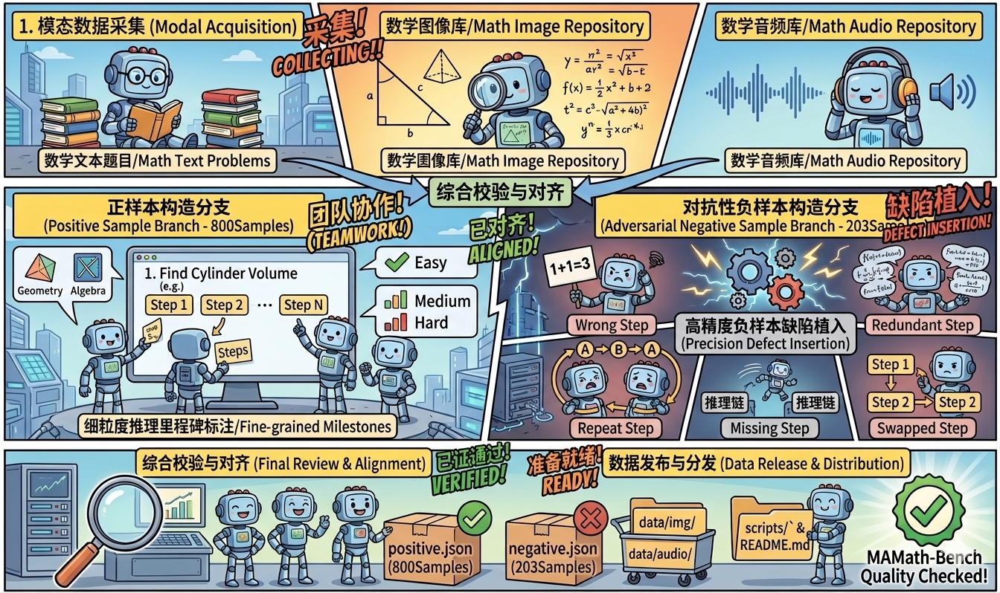
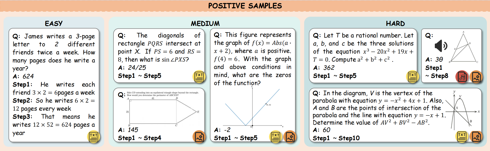
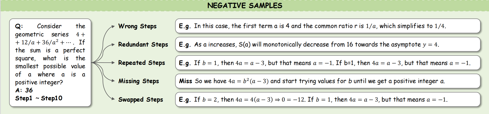

# 📐 多模态多智能体数学推理基准 （A Comprehensive Multi-modal Multi-agent Benchmark for Mathematical Reasoning）

[](#dataset-statistics) [](#key-features) 
---

## 💡 核心概述 (Overview)

**MAMath-Bench** 是首个专为**大模型多智能体系统 (Multi-Agent Systems)** 设计的多模态数学推理基准。当前数学推理评估主要面临三大挑战：**模态单一化**、**评估结果化**以及**协作脆弱性**。

为了弥补这些空白，MAMath-Bench 提供了 1,003 个高质量样本，不仅包含多模态（文本、图像、音频）输入，更引入了**分步推理里程碑 (Milestones)** 指标与**对抗性负样本 (Adversarial Negative Samples)**，旨在全方位评估多智能体协作中的信息对齐、逻辑推理及错误自愈能力。

---

## 🚀 核心贡献 (Key Contributions)

1.  **多模态融合推理范式**：突破了传统纯文本数学评估，涵盖文本、图像、音频及图文组合 4 类输入，还原真实教学与科研场景。
2.  **过程导向的细粒度评估**：为 800 个正样本标注了逻辑里程碑（Milestones），支持评估智能体在推理链条中的每一个关键步骤，而非仅判断最终结果。
3.  **对抗性鲁棒性基准**：构建了包含 5 类逻辑缺陷的负样本库，专门用于测试多智能体系统在面对“错误前提”或“逻辑陷阱”时的检测、诊断与纠偏能力。
4.  **高难度梯次设计**：覆盖从基础算术到国际数学奥林匹克（IMO）难度，推理步数最高达 20 步，极具挑战性。

<div align="center">
  
  <p>图1：数据集构造流程</p>
</div>

---

## 🔍 基准设计 (Benchmark Design)

### 1. 多维度覆盖 (Multidimensional Coverage)

本数据集根据模态和难度划分成不同难度的数据：
 -   **Easy (1-3 步)**：仅含有文本数据，主要为基础运算与简单应用题。
 -   **Medium (4-6 步)**：包含图文数据，需要多步骤逻辑转换以及多模态信息融合。
 -   **Hard (6-20 步)**：包含图文、音频数据，为竞赛级复杂推理。

<div align="center">
  
  <p>图2：正样本示例</p>
</div>

### 2. 对抗性负样本 (Adversarial Robustness)
针对多智能体协作中常见的“盲目追随”现象，我们设计了 203 个负样本，涵盖 5 类逻辑缺陷：
-   **错误步骤 (Wrong Steps)**：计算或逻辑推导错误。
-   **冗余步骤 (Redundant Steps)**：干扰项，测试推理的简洁性。
-   **重复步骤 (Repeated Steps)**：循环论证测试。
-   **缺失步骤 (Missing Steps)**：跳跃性逻辑漏洞。
-   **顺序错乱 (Swapped Steps)**：前置条件与结论倒置。
</div><div align="center">
  
  <p>图3：对抗样本示例</p>
</div>

## 📊 数据统计 (Dataset Statistics)
<div align="center">  <a href="images/fig11.pdf" target="_blank">  </a> <p>图4：难度、模态与推理步骤复杂度分布</p> </div>

### 数据分布概览
| 指标分类 | 详细项 | 数量 / 占比 |
| :--- | :--- | :--- |
| **样本总量** | Total Samples | **1,003** |
| **推理类型** | Positive (正样本) / Negative (对抗样本) | 800 / 203 |
| **难度分布** | Easy / Medium / Hard | 200 / 300 / 300 (Positive) |
| **模态分布** | Text, Image, Audio, Multi-modal | 4 类组合 |
| **领域覆盖** | Algebra, Geometry, Number Theory, etc. | 11 个领域 |

### 负样本缺陷细分 (Negative Sample Analysis)
其中**错误步骤**占比最多
| 缺陷类型 | 样本数 | 占比 | 
| :--- | :--- | :--- | 
| 错误步骤(Wrong Steps) | 83 | 40.9% | 
| 冗余步骤(Redundant Steps) | 30 | 14.8% | 
| 重复步骤(Repeated Steps) | 30 | 14.8% | 
| 缺失步骤(Missing Steps) | 30 | 14.8% | 
| 顺序错乱(Swapped Steps) | 30 | 14.8% | 

---

## 📂 数据结构与格式 (Data Structure)

### 目录树
```text
MAMath-Bench/
├── data/
│   ├── positive.json       # 正样本库 (含 Milestone 标注)
│   ├── negative.json       # 对抗性负样本库
│   ├── img/                # 几何图形、手写公式、图表
│   └── audio/              # 语音播报题目音频
├── scripts/                # 自动评估脚本
└── README.md
```

### 数据项示例 (Example Entry)
```json
{
  "id": 1,
  "modality": "image-text",
  "image": "img/geometry_001.png",
  "audio":"null",
  "type":"Geometry",
  "difficulty": "medium",
  "problem": "Calculate the area of the shaded region in the provided image.",
  "final_answer": "12.5",
  "milestones_number": 2,
  "milestones_0": [
    {
      {
        "image_recognition_info": "A circle with radius 5 inscribed in a square.",
      },
      {
        "audio_recognition_info": "null"
      },
      {"step_1": "Calculate the area of the square: 5 * 2 = 10; 10^2 = 100.",},
      {"step_2": "Calculate the area of the circle: π * 5^2 = 25π.",},
      {"step_3": "The shaded area is the difference..."}
    }
  ],
  "milestones_1":[ //此处包含参数与milestones_0相同，但解题思路不同
  ]
}
```

---

## 🏆 评估协议 (Evaluation Protocol)

我们整体上从编排结果和编排过程两个维度对多智能体系统进行系统且详细的评分：
#### **以编排结果为导向**：
1. **计划执行成功率** = 成功执行题目数量/总题目数量。考虑是否成功执行，而不是调用失败或者无限讨论

2. **数学结果正确率** = 正确答案数量/总题目数量。考虑数值完全一致、代数表达式等价、数值误差允许范围等情况

#### **以编排过程为导向：**
1. **中间步骤正确率** = 题目中间步骤正确率=正确里程碑数量/总里程碑数量。只有当数值完全一致、代数表达式等价、数值误差允许范围时算作正确

2. **任务分工质量得分** 考虑任务完整、依赖关系正确、步骤顺序正确 ，包含步骤冗余率和步骤缺失率两个具体指标。
步骤冗余率=多余步骤/总步骤
步骤缺失率=缺失步骤/总步骤

3. **自我纠错** 考虑解决回溯、冲突等情况，包含以下三个指标。
解决冲突沟通轮次
错误识别率=识别到的错误/总错误
错误改正率=改正的/识别到的错误

---

## 🌐 下载
```bash
# GitHub 开源仓库下载（推荐）：直接克隆本基准的 GitHub 仓库，自动获取完整数据集及配套脚本，命令如下：
git clone https://github.com/mira-ai-lab/AgentMath.git  # 替换为实际仓库地址
cd MAMath-Bench\math-220  # 进入数据集目录
```
